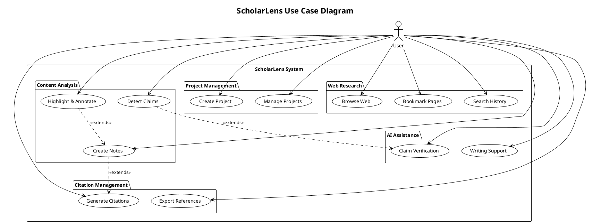
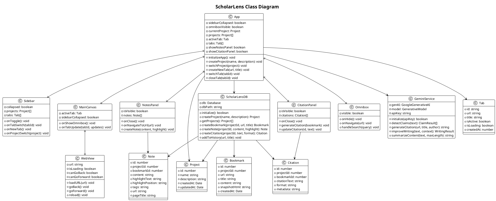
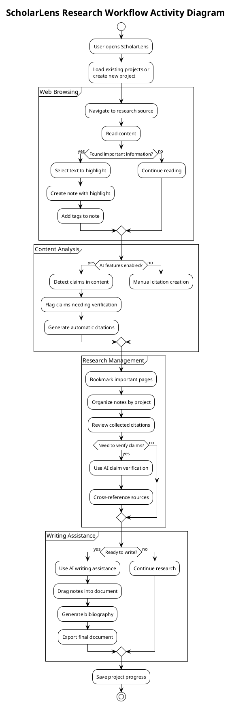
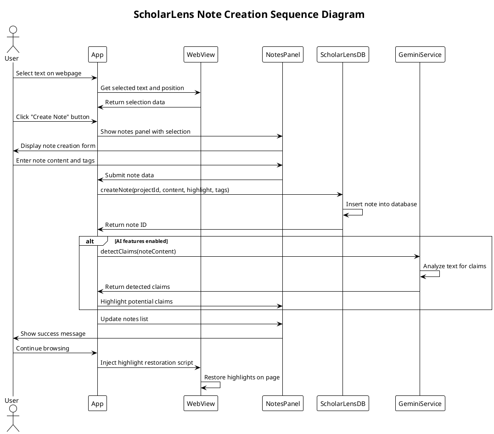
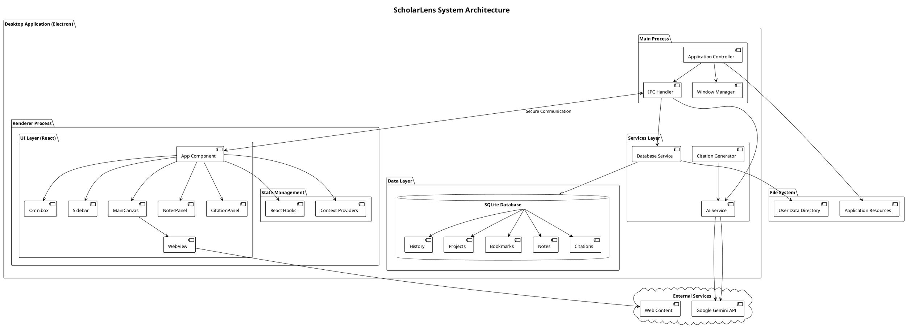
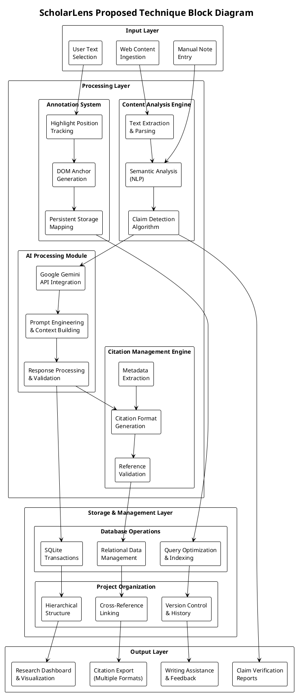

# ScholarLens PlantUML Diagrams

## Implementation Overview

ScholarLens is implemented as a desktop application using Electron as the cross-platform framework, with React serving as the frontend UI library and Node.js powering the backend services. The application follows a modular architecture where the main process handles system-level operations, database management, and AI service integration, while the renderer process manages the user interface through React components. The core functionality revolves around a WebView component that enables web browsing with enhanced research capabilities, including text highlighting, annotation overlays, and real-time content analysis. The database layer uses SQLite with the better-sqlite3 library for local data persistence, storing projects, bookmarks, notes, citations, and browsing history in a structured relational format that supports complex queries and maintains data integrity through foreign key constraints.

The AI integration leverages Google's Gemini 2.5 Flash model to provide intelligent research assistance, including automatic claim detection, citation generation, writing improvement suggestions, and content summarization. The application implements a sophisticated IPC (Inter-Process Communication) system using Electron's built-in mechanisms to facilitate secure communication between the main process and renderer processes, ensuring that sensitive operations like database access and API calls are properly isolated. The user interface employs a "Canvas & Tools" design philosophy with a collapsible sidebar for navigation, floating panels for notes and citations, and a context-aware omnibox for search and navigation. The component architecture promotes reusability and maintainability, with each major feature encapsulated in its own React component that manages its state and communicates with parent components through well-defined props and callback interfaces, while the global application state is managed through React hooks and context providers.

## System Evaluation and Testing

To evaluate the functionality and performance of the proposed ScholarLens research-centric browser system, a working prototype was developed and tested across multiple research workflows. The prototype demonstrates AI-powered claim detection, automatic citation generation, text highlighting with persistent annotations, project-based research organization, and intelligent content analysis within a comprehensive desktop environment. The system successfully conducted research sessions where users created different project modules such as Academic Research, Journalism Investigation, and Content Writing projects. During the research process, the system captured web content dynamically and recorded user annotations through text highlighting and note-taking interfaces. The content analysis module processed the collected information and sent it to the AI evaluation system for claim verification and citation assistance.

The evaluation process was performed using the Google Gemini AI API, which analyzed research content based on parameters such as factual accuracy, citation requirements, and claim verification needs. The system generated automated citations in multiple formats (APA, MLA, Chicago) and provided writing improvement suggestions after analyzing each piece of content. This automated research assistance helped simulate a comprehensive academic research environment and allowed researchers to understand content credibility and citation requirements effectively. System performance was validated by testing multiple research sessions, content bookmarking, and AI-powered analysis workflows. The platform successfully handled web content capture, annotation processing, and AI feedback generation without significant delays, confirming that the system can provide interactive and real-time research assistance for users. The results demonstrate that the ScholarLens system effectively supports academic and professional research by providing automated citation management, intelligent claim detection, and comprehensive research organization tools, validating that the proposed system improves research efficiency, source credibility verification, and knowledge synthesis workflows.

## 1. Use Case Diagram

## 2. Class Diagram

## 3. Activity Diagram

## 4. Sequence Diagram

## 5. System Architecture Diagram

## 6. Proposed Technique Block Diagram

